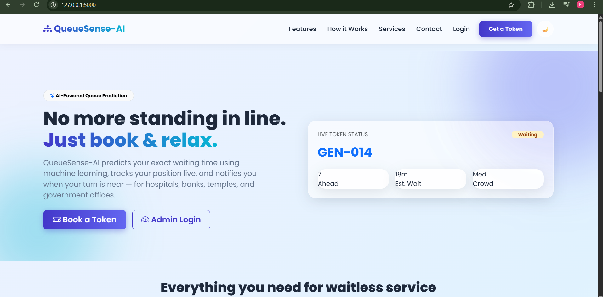
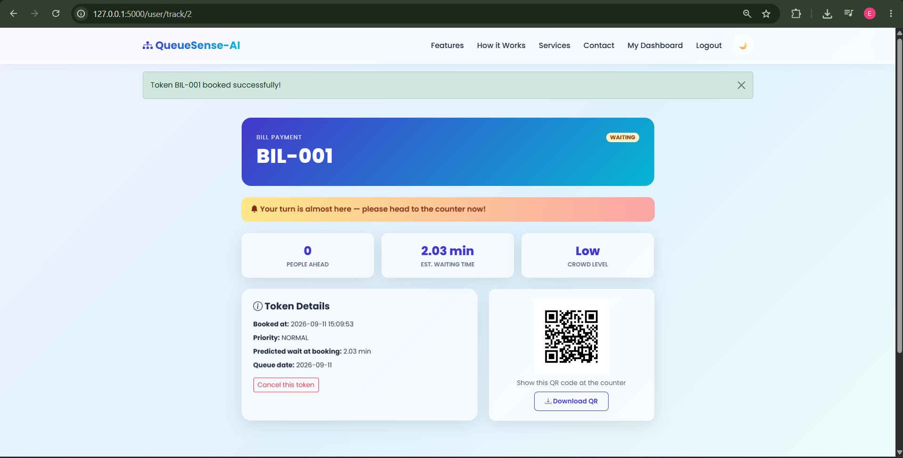
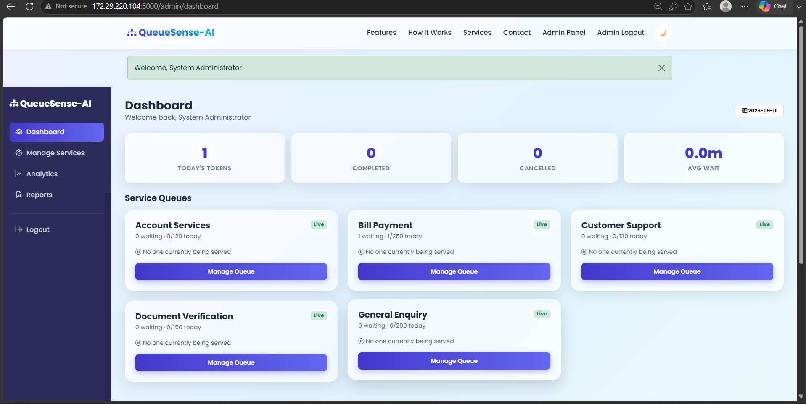
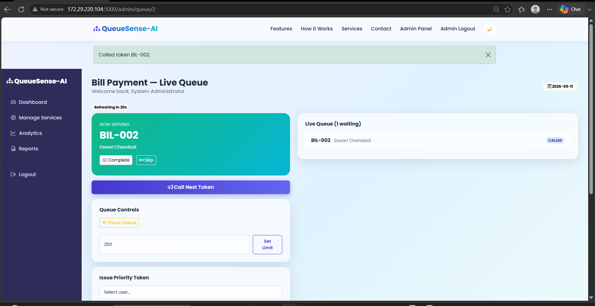

# QueueSense-AI
### AI-Powered Online Token & Smart Queue Management System

QueueSense-AI eliminates physical waiting lines. Users book a token online, an ML model predicts their waiting time, and their queue position updates live until it's their turn. Administrators get a full control panel to manage counters, queues, priority cases, and operational analytics.

---

## 1. Project Overview

QueueSense-AI is a full-stack Flask web application that combines a real machine-learning pipeline with a modern, glassmorphism-styled SaaS-like UI. It was built to demonstrate an end-to-end applied ML + web engineering project suitable for a Data Science / Software Engineering placement portfolio.

## 2. Problem Statement

Physical queues at hospitals, banks, government offices, and temples cause:
- Wasted citizen time standing in line with no visibility into wait times
- Overcrowded waiting areas and poor social distancing
- No data-driven way for administrators to plan counters/staffing
- No mechanism to prioritize emergencies or VIP cases fairly

## 3. Solution

QueueSense-AI replaces the physical line with a **virtual, AI-predicted queue**:
- Citizens register, pick a service, and receive an instant token with a **machine-learning-predicted waiting time**
- The token's position updates live (polled via a JSON API) so users know exactly when to arrive
- QR codes give a fast, contactless way to verify tokens at the counter
- Administrators get a real-time control panel: call next, complete, skip, pause/resume queues, issue VIP/emergency tokens, adjust daily limits, and view rich analytics
- A trained `RandomForestRegressor` continuously informs both the citizen-facing wait estimate and admin-facing operational suggestions (e.g. "open another counter", "best visiting hours")

## 4. Architecture

```
                     ┌───────────────────────────┐
                     │        Browser (UI)       │
                     │  Bootstrap5 + Chart.js JS  │
                     └─────────────┬─────────────┘
                                   │ HTTP
                     ┌─────────────▼─────────────┐
                     │        Flask app.py        │
                     │  ┌───────┐ ┌────────┐      │
                     │  │auth_bp│ │user_bp │ ...  │
                     │  └───────┘ └────────┘      │
                     │        admin_bp             │
                     └───────┬──────────┬─────────┘
             ┌───────────────┼──────────┼───────────────┐
             │               │          │               │
      ┌──────▼─────┐  ┌──────▼─────┐ ┌──▼───────┐ ┌─────▼──────┐
      │token_manager│  │queue_manager│ │analytics │ │  reports   │
      └──────┬─────┘  └──────┬─────┘ └──┬───────┘ └─────┬──────┘
             │               │          │               │
             └───────┬───────┴────┬─────┴───────┬───────┘
                      │            │             │
               ┌──────▼─────┐ ┌────▼───────┐ ┌───▼────┐
               │ database.py│ │prediction.py│ │ai_model│
               │  (SQLite)  │ │             │ │(sklearn)│
               └────────────┘ └────────────┘ └────────┘
```

- **Presentation layer**: Jinja2 templates + Bootstrap 5 + custom CSS (glassmorphism/gradients/dark-mode) + vanilla JS + Chart.js
- **Controller layer**: Flask Blueprints (`auth`, `user`, `admin`) — thin route handlers only
- **Business logic layer**: `token_manager.py`, `queue_manager.py`, `analytics.py`, `reports.py`, `prediction.py`
- **ML layer**: `ai_model.py` — synthetic data generation + RandomForestRegressor training/persistence (joblib)
- **Data layer**: `database.py` — SQLite via a lightweight repository pattern (no ORM)

## 5. Features

### User Module
- Registration & secure login (hashed passwords)
- Book an online token for any active service
- Live queue tracking (auto-refreshing position, wait time, crowd level)
- Downloadable QR code per token
- Near-turn notification banner
- Full token history & profile page

### Admin Module
- Secure admin login
- Live dashboard across all services (today's stats + per-service queue state)
- Call Next / Complete / Skip token
- Pause / Resume a service's queue
- Issue VIP / Emergency priority tokens
- Set max daily token limits
- Manage services (create, edit counters/timing/limits, activate/deactivate)
- Analytics dashboard (8 Chart.js visualizations) + AI-generated suggestions
- Generate & download PDF reports (daily operations, AI prediction accuracy)

### AI Features
- Synthetic historical dataset generator with realistic rush-hour/day-of-week patterns
- `RandomForestRegressor` trained on service, hour, day-of-week, queue length, counters open
- Live wait-time & crowd-level prediction
- Peak-hour analysis per service
- Actionable suggestions (open another counter, reduce wait, adjust limits, best visiting hours)

## 6. Tech Stack

| Layer | Technology |
|---|---|
| Frontend | HTML5, CSS3, Bootstrap 5, vanilla JavaScript |
| Backend | Python 3, Flask (Blueprints, MVC-style) |
| Database | SQLite |
| Machine Learning | scikit-learn (RandomForestRegressor), pandas, NumPy |
| Charts | Chart.js |
| QR Codes | `qrcode` + Pillow |
| PDF Reports | ReportLab |

## 7. Installation

```bash
# 1. Clone / unzip the project
cd QueueSense_AI

# 2. Create a virtual environment (recommended)
python3 -m venv venv
source venv/bin/activate      # Windows: venv\Scripts\activate

# 3. Install dependencies
pip install -r requirements.txt

# 4. Run the app (the database, default admin, default services, and ML
#    model are all created/trained automatically on first run)
python app.py
```

The app will be available at **http://localhost:5000**.

**Default admin login:** `admin` / `Admin@123` (change this in production — see `database.py::_seed_default_admin`).

To retrain the ML model manually at any time:
```bash
python ai_model.py
```

## 8. Project Structure

```
QueueSense_AI/
├── app.py                 # Flask app, blueprints, routes
├── config.py              # Central configuration
├── database.py            # SQLite schema + data-access helpers
├── ai_model.py             # Synthetic data + RandomForest training
├── prediction.py           # Live prediction + AI suggestions
├── queue_manager.py         # Admin queue control operations
├── token_manager.py         # Token booking, QR generation
├── analytics.py             # Chart data aggregation
├── reports.py               # ReportLab PDF report generation
├── requirements.txt
├── README.md
├── models/                 # Trained model + encoders + synthetic dataset (generated)
├── static/
│   ├── css/ (style.css, dashboard.css, admin.css, login.css)
│   ├── js/  (dashboard.js, admin.js, queue.js)
│   ├── qrcodes/            # Generated per-token QR codes
│   └── reports/            # Generated PDF reports
└── templates/
    ├── base.html, admin_base.html
    ├── index.html, services.html
    ├── login.html, register.html, admin_login.html
    ├── user_dashboard.html, book_token.html, track_token.html, profile.html
    └── admin_dashboard.html, analytics.html, reports.html
```

## 9. Libraries Used

- **Flask** — web framework & routing
- **Werkzeug** — password hashing, dev server
- **scikit-learn** — RandomForestRegressor, train/test split, metrics
- **pandas / NumPy** — synthetic dataset generation & feature handling
- **joblib** — model persistence
- **qrcode / Pillow** — QR code image generation
- **ReportLab** — PDF report generation
- **Bootstrap 5 / Chart.js** — frontend UI & data visualization (via CDN)

## 10. Screenshots

### Landing Page


### Real-Time AI Token Tracking


### Admin Dashboard


### Live Queue Control


## 11. Future Scope

- Real-time updates via WebSockets instead of polling
- SMS / email notifications when a user's turn is near
- Multi-branch / multi-location support with a location picker
- Migrate from SQLite to PostgreSQL for multi-instance deployments
- Online payment integration for paid services (e.g. document fees)
- Mobile app (Flutter/React Native) consuming the same Flask backend as a REST API
- Replace the RandomForest baseline with a gradient-boosted model (XGBoost/LightGBM) and online learning as more real data accumulates

---
Built with Python, Flask, and scikit-learn.

---
Built with Python, Flask, and scikit-learn.
